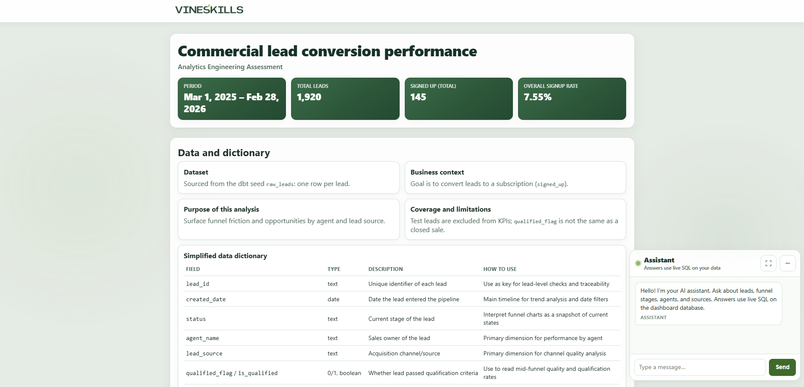

# Analytics Engineer Assessment

<p align="center">
  <a href="https://www.python.org/"></a>
  <a href="https://fastapi.tiangolo.com/"></a>
  <a href="https://www.getdbt.com/"></a>
  <a href="https://duckdb.org/"></a>
  <a href="https://platform.openai.com/"></a>
  <a href="./web/"></a>
</p>

This repository implements a technical analytics stack for a lead-conversion workflow.  
Raw lead records are transformed with **dbt + DuckDB** into analytics-ready models, exposed through a **FastAPI** service, and consumed by a static **dashboard** that also includes an AI assistant for real-time analytical Q&A over the database (via OpenAI API + validated read-only SQL execution).

The data model is centered on lead lifecycle analysis (intake, qualification, signup), with segmentation by agent, source, status, and time. The project is designed to show practical analytics engineering patterns:

- layered dbt modeling (`staging` -> `intermediate` -> `marts`)
- reproducible local warehouse execution in DuckDB
- API-first consumption of curated marts
- dashboard integration over filtered API endpoints
- dashboard AI agent integration through OpenAI tool-calling and validated read-only SQL

## Preview



## Technical Architecture

1. **Transformation + Warehouse:** `dbt` runs transformations on top of `DuckDB`, materializing analytics-ready tables and marts from the seed dataset.
2. **Serving layer:** `FastAPI` exposes curated metrics and filtered analytical endpoints backed by DuckDB.
3. **Consumption layer:** the `web/` dashboard consumes FastAPI endpoints for visualization.
4. **AI assistant layer:** the dashboard also integrates an OpenAI-powered assistant that answers analytical questions in real time through validated read-only SQL execution.

## Repository Layout

| Path | Purpose |
|---|---|
| `backend/` | Python backend (`api.py`, `assistant_chat.py`, runtime SQLite under `backend/data/`) |
| `web/` | Dashboard (`index.html`, `app.css`, `dashboard.js`) |
| `vineskills_analytics/` | dbt project (models, seeds, docs config, profiles) |
| `requirements.txt` | Python dependencies |

## Prerequisites

- Python 3.10+
- `pip`
- Optional: `OPENAI_API_KEY` for assistant endpoints

Install dependencies once from the repository root:

```bash
pip install -r requirements.txt
```

## Start Services by Operating System

Run one dbt preparation step, then start the 3 services.

### Windows (PowerShell)

Terminal 1 (prepare warehouse artifacts):

```powershell
cd .\vineskills_analytics
dbt build
dbt docs generate
cd ..
```

Terminal 2 (FastAPI):

```powershell
uvicorn backend.api:app --reload --host 127.0.0.1 --port 8000
```

Terminal 3 (dbt docs):

```powershell
cd .\vineskills_analytics
dbt docs serve --port 8081
```

Terminal 4 (dashboard static server):

```powershell
python -m http.server 8080
```

### macOS / Linux (zsh/bash)

Terminal 1 (prepare warehouse artifacts):

```bash
cd vineskills_analytics
dbt build
dbt docs generate
cd ..
```

Terminal 2 (FastAPI):

```bash
uvicorn backend.api:app --reload --host 127.0.0.1 --port 8000
```

Terminal 3 (dbt docs):

```bash
cd vineskills_analytics
dbt docs serve --port 8081
```

Terminal 4 (dashboard static server):

```bash
python3 -m http.server 8080
```

## URLs

- FastAPI Swagger: `http://127.0.0.1:8000/docs`
- FastAPI ReDoc: `http://127.0.0.1:8000/redoc`
- FastAPI Health: `http://127.0.0.1:8000/health`
- dbt Docs: `http://127.0.0.1:8081`
- Dashboard: `http://127.0.0.1:8080/web/`

## Environment Variables

| Variable | Role |
|---|---|
| `DUCKDB_PATH` | Path to DuckDB used by API and assistant |
| `OPENAI_API_KEY` | Required for assistant endpoints |
| `OPENAI_MODEL` | Optional model override for assistant |
| `ASSISTANT_SQLITE_PATH` | Optional override for assistant SQLite path |
